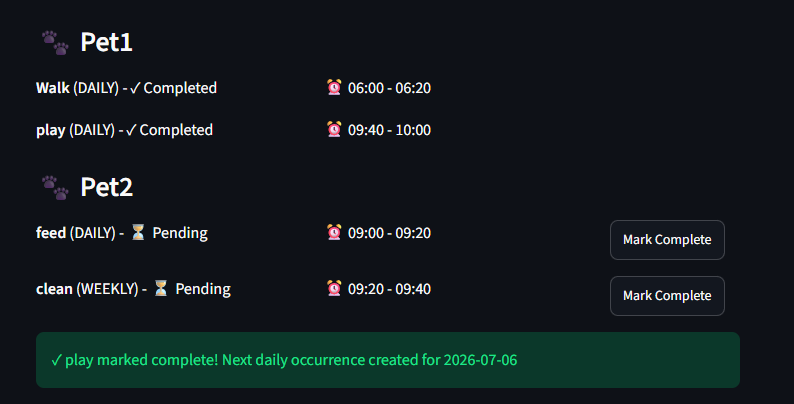
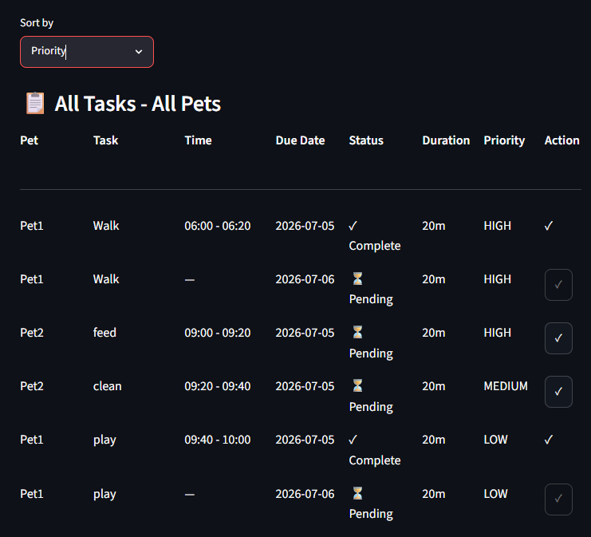
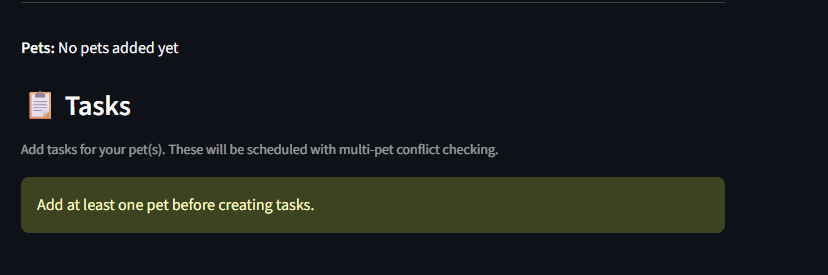

# PawPal+ (Module 2 Project)

You are building **PawPal+**, a Streamlit app that helps a pet owner plan care tasks for their pet.

## 🖥️ Sample Output

```
# DAILY SCHEDULE FOR LUNA
============================================================

# TASK DETAILS WITH SCHEDULING RATIONALE:
------------------------------------------------------------

# 1. 09:15 - 09:25 | Feeding
   ├─ Scheduling Rationale:
   │  High priority task scheduled first | Essential feeding time for pet health | Scheduled within morning preference window | Daily recurring task | Time selected to avoid conflicts with other pets' schedules

# 2. 09:25 - 09:45 | Playtime
   ├─ Scheduling Rationale:
   │  Medium priority task scheduled after high-priority tasks | Enrichment activity for mental stimulation | Scheduled within morning preference window | Daily recurring task | Time selected to avoid conflicts with other pets' schedules

```

## 🧪 Testing PawPal+

```bash
# Run the full test suite:
pytest

# Run with coverage:
pytest --cov

#
python -m pytest
```

The tests implemented include:

- TestSortingEdgeCases which tests sorting tasks with identical and/or invalid priorities and frequencies. It also tests the correctness of priority ordering from high to low.
- TestRecurringTaskEdgeCases: Tests if recurring tasks are correctly rescheduled (+1 day for daily and +1 week for weekly). Non-recurring tasks return None. Month and year boundary crossings are also tested. When a recurring task is completed at the end of the month or year, it should reschedule in the next month or year.
- TestSchedulingGapsAndConflicts: Tests to make sure tasks do not conflict and returns a warning if so. Also tests for multi-pet conflict.
- TestTaskCompletionWithRecurrence: Tests for successful completion of tasks and that they are appropriately rescheduled if necessary based on recurrence.

Sample test output:

```
(.venv) PS F:\CodePathAI110\ai110-module2show-pawpal-starter> python -m pytest
================================= test session starts ==================================
platform win32 -- Python 3.13.5, pytest-9.0.3, pluggy-1.6.0
rootdir: F:\CodePathAI110\ai110-module2show-pawpal-starter
plugins: anyio-4.13.0
collected 28 items

tests\test_paypal.py ............................                                 [100%]

================================== 28 passed in 0.06s ==================================
```

Based on the 100% test result and after evaluation of tests implemented by the AI companion, my confidence level in the reliability of the system is 5 stars.

## 📐 Smarter Scheduling

> Fill in once you've implemented scheduling logic.

| Feature           | Method(s)                                                                                     | Notes                                                                                                                                 |
| ----------------- | --------------------------------------------------------------------------------------------- | ------------------------------------------------------------------------------------------------------------------------------------- |
| Task sorting      | Scheduler.get_sorted_tasks()                                                                  | Sorts by priority and frequency                                                                                                       |
| Filtering         | Scheduler.get_filtered_tasks()                                                                | Filter the current pet's tasks based on completion status, schedule status, and frequency.                                            |
| Conflict handling | Scheduler.check_owner_conflict()                                                              | Check if owner is busy with another pet at this task's time (multi-pet conflict). Only checks conflicts on the same date as the task. |
| Recurring tasks   | (1) Pet.mark_task_complete(task), (2) Task.mark_complete(), (3) Task.create_next_occurrence() | (1) Calls (2) to mark a task as complete, calls (3) to generate the next occurrence if recurring and adds it to the pet's task list   |

## 📸 Demo Walkthrough

Describe your app in numbered steps so a reader can follow along without watching a video:

1. Owner enters personal information and preferences
2. Enter pet's information (name, type, breed, age) and click 'add pet' to register the pet.
3. Modify information entered and click 'add pet' to register additional pets as needed
4. Repeat steps 2 and 3 to add additional pets as needed
5. Adding pets enables task creation.
6. Select registered pet from dropdown and enter task details (title, priority, duration, etc). Click 'add task' to register task for selected pet.
7. Modify task details and click 'add task' to register additional tasks.
8. Repeat steps 6 and 7 to add additional tasks for every registered pet.
9. With all pets and tasks information, click 'Generate Schedule' to get a detailed schedule with reasoning
10. Scheduled tasks have a 'complete' button to mark them as complete
11. Recurring tasks are automatically recreated for the appropriate dates.

**Demo video** :  
 <video controls src="20260706-0313-30.1358615.mp4" title="Title"></video>

## Challenge 3: Advance priority scheduling

```

================================================================================
PRIORITY-BASED SCHEDULING VISUALIZATION
================================================================================

SCHEDULING QUEUE - by priority order:

Order    Priority   Pet          Task                 Duration Scheduled
--------------------------------------------------------------------------------
1        HIGH       Max          Morning Walk         30 min  YES
2        HIGH       Max          Breakfast            15 min  YES
3        HIGH       Luna         Feeding              10 min  YES
4        MEDIUM     Max          Afternoon Walk       30 min  YES
5        MEDIUM     Luna         Playtime             20 min  YES


DAILY SCHEDULE TIMELINE:


Max's Schedule:
-------------------------------------------------------------------------
 HIGH   06:00-06:30  Morning Walk         Duration: 30 min  SCHEDULED
 HIGH   09:00-09:15  Breakfast            Duration: 15 min  SCHEDULED
 MED    06:30-07:00  Afternoon Walk       Duration: 30 min  SCHEDULED
-------------------------------------------------------------------------

Luna's Schedule:
-------------------------------------------------------------------------
 HIGH   09:15-09:25  Feeding              Duration: 10 min  SCHEDULED
 MED    09:25-09:45  Playtime             Duration: 20 min  SCHEDULED
-------------------------------------------------------------------------


SCHEDULING ALGORITHM IN ACTION:

Step 1: Collect all tasks
 Total tasks collected: 5

Step 2: Sort by priority level
 HIGH priority tasks:   3 task(s)
 MEDIUM priority tasks: 2 task(s)
 LOW priority tasks:    0 task(s)

Step 3: Attempt to schedule tasks (highest priority first)
 Successfully scheduled: 5 tasks
 Could not schedule:     0 tasks

```

## Challenge 4: Professional UI and Output Formatting

- Task completion management  
  Clear visual indicators by using icons to show tasks completion status(tick for completed vs hourglass for pending). A completion confirmation message in green bubble is also implemented.
  
- Task viewing and sorting  
  Task list can be sorted by default, time, or priority in a comprehensive table with necessary task details including a completion button. This button is disable for tasks not scheduled (today).
  
- The user needs to register at least one pet before registering tasks. This is indicated by yellow banner notifying the user.
  
